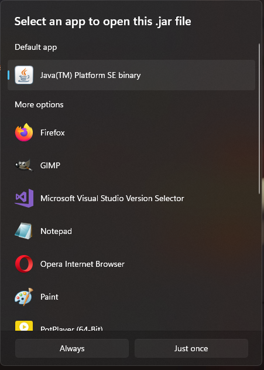

# Compilação do projeto e rodar

## Rode no Modo GUI

```
make release.gui

```

## Rode no modo Terminal

```
make release

```

## Rode como abaixo, caso tenha apenas acesso ao `.jar`.


```
java -jar <arquivo_jar>

```

### Windows
No windows é possivel clickar com o botão direito e rodar com o Java Runtime



Como no SO Windows não tem supporte a ``Ansci Escape Codes``, detectamos os OS e rodamos apenas no modo GUI.


## Projeto

Veja ``etapas.md`` para ver a capacidade basica do projeto.

Além dessas capacidades, temos supporte a auto completar de caminhos para arquivos, comandos, usuários do rabbitmq, groupos. Basta aperta TAB.

No modo Terminal, também mantemos o prompt visivel a todo momento, se ser ocluso por novas mensagens chegando.

O sistema de recebimento de arquivos é mais robusto no quesito que apenas envia o Ack para rabbitmq ao realmente escrever o arquivo em disco. Ademais, o arquivo é possivelmente enviado por partes para não sobrecarregar o servidor.


- Modo Gui


- Modo Terminal


- Envio de Arquivos por partes


## Testado com as seguintes configurações


    $ mvn --version
    Apache Maven 3.9.8 (36645f6c9b5079805ea5009217e36f2cffd34256)

    $ java --version
    java 22.0.2 2024-07-16
    Java(TM) SE Runtime Environment (build 22.0.2+9-70)
    Java HotSpot(TM) 64-Bit Server VM (build 22.0.2+9-70, mixed mode, sharing)

    $ protoc --version
    libprotoc 27.3


## ProtocolBufferers Setup


- Instalação do compilador protoc

```
sudo apt install protobuf-compiler
```

-  Uso do compilador protoc

```
protoc --java_out=src/main/java/ src/main/proto/message.proto

```

## Rabbitmq Setup

Leia ``rabbitmq.md``
